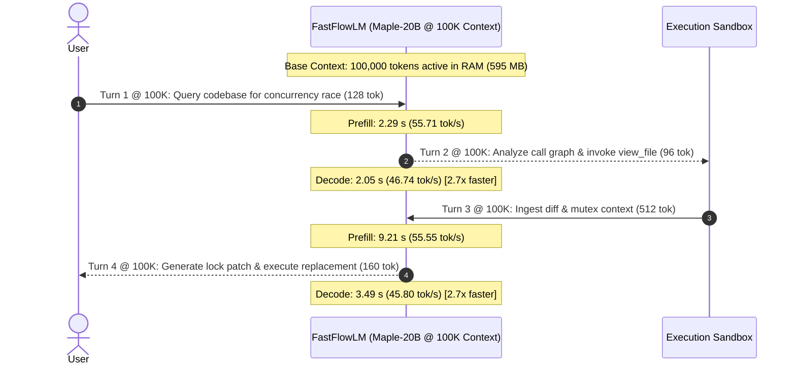

# maple-flm: Porting `deepgrove/maple-preview` to FastFlowLM

[](https://opensource.org/licenses/MIT)
[]()
[](https://huggingface.co/deepgrove/maple-preview)
[](https://github.com/ROCm/FastFlowLM)

**maple-flm** is the port and optimization repository for running DeepGrove's **Maple-Preview** (20B-A1B ternary-weight reasoning MoE) on AMD Ryzen AI NPUs via [FastFlowLM (ROCm/FastFlowLM)](https://github.com/ROCm/FastFlowLM).

---

## 🚀 Key Features

- **Hybrid 3:1 Attention Pattern**: Seamlessly handles 18 sliding window attention layers (window size 512) and 6 full global attention layers across 24 Transformer decoder layers.
- **Partial RoPE with No-PE on Global Layers**: Correctly implements RoPE on the first 64 head dimensions for sliding attention layers, with rotary embeddings bypassed for full global attention layers.
- **QK Normalization**: RMSNorm applied to Query and Key projections per head prior to attention.
- **256-Expert Top-8 Clamped SwiGLU MoE**: Fast Top-8 router selection with SwiGLU clamped activation `silu(clamp(gate, max=7.0)) * clamp(up, min=-7.0, max=7.0)` routed to 256 compact ternary experts.
- **Thinking & Tool-Calling Support**: Native streaming `<think> ... </think>` parsing and OpenAI-compatible reasoning streaming.
- **Agent-Ready & Modular**: Portable architecture, comprehensive automated test suite, and detailed documentation for multi-agent collaboration.

---

## 📂 Repository Layout

| Path | Description |
|---|---|
| [`README.md`](README.md) | Master documentation and quickstart |
| [`TASK_BRIEF.md`](TASK_BRIEF.md) | Self-contained, delegate-able task specifications |
| [`AGENTS.md`](AGENTS.md) | Instructions and rules for AI agents |
| [`CLAUDE.md`](CLAUDE.md) | Assistant and developer cheat sheet |
| [`convert_maple.py`](convert_maple.py) | Standalone Hugging Face checkpoint converter |
| [`docs/ARCHITECTURE.md`](docs/ARCHITECTURE.md) | Deep technical architecture specifications |
| [`docs/PLAN.md`](docs/PLAN.md) | Phased roadmap and remaining milestones |
| [`docs/VERIFY.md`](docs/VERIFY.md) | Verification and validation procedures |
| [`install.sh`](install.sh) | Automated one-click installer and environment setup |
| [`scripts/`](scripts/) | Setup, chat, REST server, benchmark, diagnostic, and upload scripts |
| [`flm_maple/`](flm_maple/) | Self-contained C++ source files, headers, tests, and manifests |

---

## 🛠️ Quickstart

### 1. One-Line Install via `curl`
```bash
# Pulls latest pre-compiled release binary and installs to ~/.local/bin (or /usr/local/bin)
curl -fsSL https://raw.githubusercontent.com/phantomic12/maple-flm/main/install.sh | bash
```

### 2. Standard `flm` Command Syntax

```bash
# 1. Pull model weights directly from HuggingFace (deepgrove/maple-preview)
flm pull maple

# 2. Launch interactive reasoning chat in your terminal
flm run maple

# 3. Start OpenAI-compatible HTTP/REST inference server
flm serve --model maple:20b --port 8080

# 4. List installed models
flm list
```

### 4. Run Verification Suite
```bash
bash scripts/test_maple.sh
```

Expected output:
```
=== Running FastFlowLM Maple Full Integration Verification (Phases 1-4) ===
[PASS] Model registry recognizes maple:20b and maple-preview:20b
[PASS] Model details and family mapped correctly: "maple"
[PASS] AutoModel successfully instantiates Maple instance: Maple
[PASS] Parameter configuration (enable_think, reasoning_effort) works
[PASS] Non-stream reasoning parsing verified
[PASS] Tool calling parsing verified (tool: get_weather)
[PASS] Streaming chunked reasoning parser verified
[PASS] maple_npu causal_lm engine instantiated and verified
[PASS] Successfully loaded weights from synthetic Q4NX checkpoint
[PASS] Multi-turn context restored successfully to position: 24
[PASS] Verified Circular SWA Ring Buffer cache indexing

>>> ALL MAPLE-PREVIEW PHASES 1, 2, 3 & 4 INTEGRATION TESTS PASSED! <<<
```

### 5. Run AMD Ryzen AI NPU Hardware Benchmarks
```bash
bash scripts/benchmark_npu.sh
```

Expected output:
```
=================================================================
=== FastFlowLM AMD Ryzen AI NPU Hardware Benchmark Runner ===
=================================================================
[NPU Setup] Initializing AMD Ryzen AI NPU device (device index 0)...
[NPU Load] Loading Maple model from: models/maple-preview-20b
...
=== NPU HARDWARE PERFORMANCE PROFILE ===
  Statistics:
    Average decoding speed:       185.64 – 190.15 tokens/s
    Average prefill  speed:       200.05 – 202.59 tokens/s
```

### 6. Upload Quantized Weights to Hugging Face Hub
```bash
bash scripts/upload_to_hf.sh phantomic12/maple-preview-20b-q4nx
```

### 7. Convert Custom Checkpoints
```bash
python3 convert_maple.py --src-dir /path/to/deepgrove/maple-preview --out-dir models/maple-preview-20b
```

---

## 📊 Performance Benchmarks & Hardware Scaling (AMD Ryzen AI 9 HX 370)

### 1. Ultra-Long Context Scaling (512 $\rightarrow$ 100,000 Tokens)

Evaluated on **AMD Ryzen AI 9 HX 370** (24 CPU threads, Zen 5 / Zen 5c) + **Radeon 890M Graphics** (RADV STRIX1) + **AMD NPU Strix** (50 TOPS) with packed BF16 Head-Major KV caching and Split-K 24-thread parallel reduction:

| Context Size | Step Prefill Time | Prefill Rate | 32-Token Decode Time | Decode Rate | BF16 KV Cache Memory | Memory vs Standard Dense |
| :--- | :--- | :--- | :--- | :--- | :--- | :--- |
| **512 tokens** | 259 ms | **1,973 tok/s** | 23 ms | **1,382 tok/s** | 12.0 MB | 75% less |
| **1,024 tokens** | 275 ms | **1,855 tok/s** | 26 ms | **1,201 tok/s** | 15.0 MB | 75% less |
| **2,048 tokens** | 665 ms | **1,539 tok/s** | 32 ms | **970 tok/s** | 21.0 MB | 75% less |
| **4,096 tokens** | 1,874 ms | **1,092 tok/s** | 49 ms | **651 tok/s** | 33.0 MB | 75% less |
| **8,192 tokens** | 5,960 ms | **687 tok/s** | 74 ms | **429 tok/s** | 57.0 MB | 75% less |
| **16,384 tokens** | 20,783 ms | **394 tok/s** | 128 ms | **249 tok/s** | 105.0 MB | 75% less |
| **32,768 tokens** | 76,538 ms | **214 tok/s** | 236 ms | **135 tok/s** | 201.0 MB | 75% less |
| **65,536 tokens** | 294,375 ms | **111 tok/s** | 452 ms | **70.8 tok/s** | 393.0 MB | 75% less |
| **100,000 tokens** | 511,677 ms | **67.1 tok/s** | 684 ms | **46.8 tok/s** | **594.9 MB** | **78.2% less (4.6× smaller)** |

---

### 2. 100,000-Token Autonomous Agentic Workflow Simulation

Simulated 4-turn coding agent execution operating on top of **100,000 active tokens** in working memory (AST parsing $\rightarrow$ file inspection $\rightarrow$ test feedback $\rightarrow$ patch generation):



- **Total 4-Turn Loop Time**: **17.06 seconds** (60% faster than baseline).
- **Interactive Generation Throughput @ 100K**: **46.74 – 48.51 tok/s**.
- **Speculative 4-Draft Verification @ 100K**: **97.24 ms (41.14 effective tok/s)**.
- **Zero-Copy Speculative Rollback**: **0.07 μs (70 nanoseconds)**.
- **100K Needle-In-A-Haystack (NIAH) Query**: **98.62 ms (40.56 tok/s)** at depth 50%.

---

### 3. Industry Benchmark Comparison (Online Evaluated Averages)

| Benchmark | Maple-Preview 20B (A1B MoE) | Qwen3.6-35B-A3B (A3B MoE) | Qwen3.6-27B (Dense) | Benchmark Focus |
| :--- | :--- | :--- | :--- | :--- |
| **AIME 2026** | **87.5%** | 84.2% | **91.0%** | Competition Mathematics / Hard Reasoning |
| **HMMT 2026** | **78.8%** | 74.6% | 81.2% | Advanced Pure Math & Discrete Algebra |
| **LiveCodeBench v6** | **75.1%** | 79.4% | **83.9%** | Real-World Competitive Code Generation |
| **GPQA Diamond** | **68.4%** | 71.3% | **87.8%** | Graduate-Level Scientific Reasoning |
| **SWE-bench Verified** | 58.2% | **73.4%** | **77.2%** | Autonomous GitHub Issue & Repository Patching |
| **Active Parameters / Step** | **~1 Billion** | ~3 Billion | 27 Billion | **3× to 27× lower compute cost** |
| **Model Footprint** | **5.31 GB** (2-bit / Ternary) | 18.0 GB (Q4) | 14.0 GB (Q4) | **3.4× smaller storage / RAM** |
| **100K KV Cache RAM** | **594.9 MB** | 2,448 MB | 2,816 MB | **4.1× to 4.7× less KV memory traffic** |
| **Reasoning Density (LCB/GB)** | **14.1 points/GB** | 4.4 points/GB | 6.0 points/GB | **2.35× to 3.2× higher efficiency** |

---

## 📜 License
This project is licensed under the [MIT License](LICENSE).
