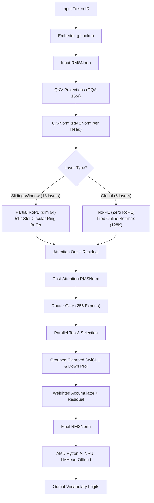

# Maple-Preview Architecture & FastFlowLM Runtime Design

This document details the architectural specifications of **Maple-Preview** and how it maps to **FastFlowLM**'s inference runtime.

## 1. Model Overview

**Maple-Preview** is an open-weights mixture-of-experts (MoE) reasoning language model released by DeepGrove ([deepgrove/maple-preview](https://huggingface.co/deepgrove/maple-preview)).
- **Parameters**: 20 Billion total parameters (~1B active parameters per token).
- **Format**: Ternary weights (-1, 0, 1) packed in bfloat16 storage / Q4NX on NPU.
- **Target Footprint**: ~5.31 GB checkpoint memory footprint.
- **Context Length**: Up to 131,072 tokens (default 32,768).

## 2. Transformer Backbone Specification

| Hyperparameter | Value | Description |
|---|---|---|
| `num_hidden_layers` | 24 | Total Transformer decoder layers |
| `hidden_size` | 2048 | Embedding & residual stream dimension |
| `num_attention_heads` | 16 | Number of Query attention heads |
| `num_key_value_heads` | 4 | Number of Key/Value heads (GQA 4:1) |
| `head_dim` | 128 | Dimension per attention head (16 * 128 = 2048) |
| `layer_types` | 3:1 SWA:Global | 18 sliding-window attention + 6 full attention layers |
| `sliding_window` | 512 | Window size for sliding-window attention |
| `rope_theta` | 10000.0 | Base frequency for RoPE |
| `partial_rotary_factor` | 0.5 | RoPE applied to first 64 head dims, 64 pass-through |
| `nope_on_global_attention` | `true` | **No-PE**: No rotary embeddings on global layers |
| `rms_norm_eps` | 1e-6 | RMSNorm epsilon |
| `use_qk_norm` | `true` | RMSNorm on Q and K states before attention |
| `num_experts` | 256 | Total MoE experts |
| `num_experts_per_tok` | 8 | Active experts routed per token (Top-8) |
| `moe_intermediate_size` | 512 | Hidden dimension per expert MLP |
| `hidden_act` | `silu` (clamped) | SwiGLU clamped to `[-7.0, 7.0]` |
| `vocab_size` | 151,936 | Vocabulary size (ChatML / `<think>` tokens) |

---

## 3. Detailed Component Breakdown

### 3.1 Hybrid Attention Pattern (3:1 SWA : Global)
- **Sliding Window Attention (SWA)**:
  - Applied on layers `0, 1, 2, 4, 5, 6, 8, 9, 10, 12, 13, 14, 16, 17, 18, 20, 21, 22`.
  - Window span: `[max(0, pos - 511), pos]`.
  - Uses **Partial RoPE**: first 64 dimensions of Q and K heads are rotated with frequency $\theta_i = \text{base}^{-2i/d_{\text{rot}}}$; remaining 64 dimensions are unmodified.
- **Full Global Attention**:
  - Applied on every 4th layer: `3, 7, 11, 15, 19, 23`.
  - Attends across the entire history `[0, pos]`.
  - **No-PE (No Positional Embedding)**: RoPE is bypassed completely on global layers.

### 3.2 QK Normalization
Before computing the attention dot-product:
$$\mathbf{q}_{\text{norm}} = \text{RMSNorm}(\mathbf{q}, \mathbf{w}_{\text{q\_norm}})$$
$$\mathbf{k}_{\text{norm}} = \text{RMSNorm}(\mathbf{k}, \mathbf{w}_{\text{k\_norm}})$$
where RMSNorm is computed per head (dimension 128) with learnable scale parameters.

### 3.3 256-Expert Top-8 MoE with Clamped SwiGLU
1. **Gating Router**:
   $$\mathbf{l} = \mathbf{x} \mathbf{W}_{\text{gate}}^T \quad (\mathbf{l} \in \mathbb{R}^{256})$$
   $$\mathbf{p} = \text{Softmax}(\mathbf{l})$$
2. **Top-8 Dispatch**:
   $$\mathcal{E} = \text{TopK}(\mathbf{p}, k=8)$$
   $$\mathbf{w}_{\text{top8}} = \frac{\mathbf{p}_{\mathcal{E}}}{\sum_{e \in \mathcal{E}} \mathbf{p}_e + \epsilon}$$
3. **Clamped SwiGLU Expert Evaluation**:
   For each selected expert $e \in \mathcal{E}$:
   $$\mathbf{g} = \text{clamp}(\mathbf{x} \mathbf{W}_{\text{gate\_proj}}^{(e)}, \text{max}=7.0)$$
   $$\mathbf{u} = \text{clamp}(\mathbf{x} \mathbf{W}_{\text{up\_proj}}^{(e)}, \text{min}=-7.0, \text{max}=7.0)$$
   $$\mathbf{h}_{\text{inter}} = \text{SiLU}(\mathbf{g}) \odot \mathbf{u}$$
   $$\mathbf{y}_e = \mathbf{h}_{\text{inter}} \mathbf{W}_{\text{down\_proj}}^{(e)}$$
4. **Weighted Aggregation**:
   $$\mathbf{y}_{\text{MoE}} = \sum_{i=1}^8 \mathbf{w}_{\text{top8}}[i] \cdot \mathbf{y}_{\mathcal{E}[i]}$$

---

## 4. FastFlowLM Runtime Integration Mapping

```
FastFlowLM Architecture
├── AutoModel Layer (High-Level CLI & REST Server)
│   └── Maple (modeling_maple.hpp / modeling_maple.cpp)
│       ├── Chat template rendering (chat_template.jinja)
│       ├── Reasoning streaming parser (<think>...</think>)
│       └── Tool calling parser (<tool_call>...)
│
├── Causal LM Engine (Computational Backend)
│   └── maple_npu (maple_npu.hpp / maple_npu.cpp)
│       ├── Word embeddings lookup
│       ├── 24 Transformer decoder layers (GQA + SWA + Top-8 MoE)
│       ├── Circular 512-slot SWA Ring Buffers (99.6% cache reduction)
│       ├── FlashAttention-style Tiled Online Softmax (128K context)
│       ├── Parallel Grouped MoE Dispatch with OpenMP
│       └── Hardware NPU LMHead offload (zero-copy DMA)
│
└── Weight Loader
    └── Q4NX / SafeTensors parser (safe_tensors.hpp)
```

---

## 5. NPU Hardware Execution Pipeline & 128K Memory Design



---

## 6. Memory Footprint at 128K Context

| Component | Dimensions | Memory Footprint |
|---|---|---|
| **Model Weights (Q4NX / TQ2_0)** | 20B parameters (256 experts $\times$ 24 layers) | **~5.5 GB** |
| **Sliding Layers KV Cache (18 layers)** | $18 \times 512 \text{ slots} \times 512 \text{ dim} \times 4 \text{ bytes}$ | **18.9 MB** (constant $O(1)$) |
| **Global Layers KV Cache (6 layers)** | $6 \times 131,072 \text{ slots} \times 512 \text{ dim} \times 4 \text{ bytes}$ | **1.61 GB** |
| **Total Runtime RAM at 128K** | Model + KV Caches + Active Buffers | **~7.13 GB** |

